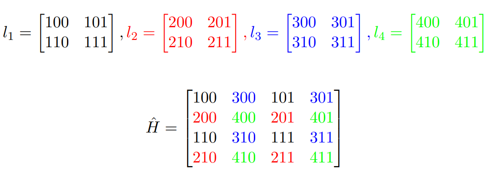

# enhancement-and-superresolution
This documentation outlines the development of an image enhancement and superresolution algorithm using Python. The project is part of the coursework for SCC0651 - Image Processing and Analysis.

## Implemented Methods

The repository encompasses the implementation of two histogram equalization methods and a Gamma Correction method, followed by the application of a superresolution algorithm.

### Histogram Equalization Methods

1. **Single Image Cumulative Histogram Method**:
    * Histogram equalization is performed individually for each image.
2. **Joint Cumulative Histogram Method**:
    * A single cumulative histogram is calculated for all four images analyzed and utilized to equalize each image.
3. **Gamma Correction Method**
    * The Gamma Correction method is implemented using the following correction function:
        $L_i(x, y) = 255 \cdot (L_i(x, y) / 255 )^{1/γk}$, where $L_i$ represents the resulting image, and γ is a user-defined parameter. 

### Superresoltion Algorithm

The superresolution algorithm aims to enhance the resolution of the images by "joining" the four images to generate an image with double the resolution. The method is detailed in the accompanying image.

After applying this algorithm, the image obtained is compared with the high-resolution image using the root mean squared error (rmse).

## How to run this project?

To run the project, follow these instructions:

1. **Explore Jupyter Notebook**:
    * Explore the Jupyter notebook to visualize the tests carried out for all the test cases images.

2. **Execute Bash Script**:
    * Run bash test.sh to visualize the root mean squared error obtained for each of the tests in the file all_results.txt.
